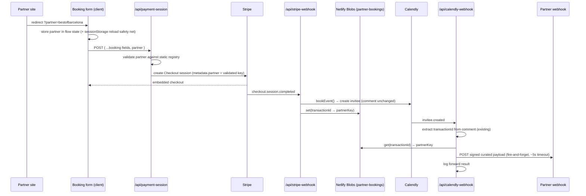

# ADR 0001: Partner Referral Attribution & Booking Webhook Forwarding

## Status

Proposed — 2026-08-18

## Context

Partners (e.g. `bestofbarcelona`) redirect users to our booking form with a
`?partner=<key>` query param. When that user completes a paid booking, we
need to notify the partner's own webhook so they know their referral
converted (and later, if it cancels).

The existing booking pipeline is:

```
Client (booking form)
  → POST /api/payment-session          (creates Stripe Checkout session, sets metadata)
  → Stripe Checkout (embedded)
  → POST /api/stripe-webhook            (checkout.session.completed → bookEvent() creates Calendly invitee)
  → POST /api/calendly-webhook          (invitee.created / invitee.canceled → Telegram notification)
```

Two webhooks already exist in this codebase (`stripe-webhook.ts`,
`calendly-webhook.ts`) and both follow the same shape: verify signature →
parse payload → fire notifications via `Promise.allSettled` (never blocking
the 200 OK response) → log a structured event via `services/logger.ts`.
Partner forwarding should follow the same shape, not invent a new one.

### Rejected approach: threading `partner` through Calendly's comment field

The original idea was: save `partner` to `sessionStorage` → include in
Stripe metadata → pass to Calendly as part of the booking "Comment"
question → parse it back out of `questions_and_answers[0].answer` when
`calendly-webhook.ts` receives the event.

Problems with that path:

- The comment field is **already** a hand-rolled 2-field text protocol
  (`formatEventComment` / `getTransactionIdFromEventComment` /
  `getSessionTitleFromEventComment` in `eventMessage.tsx`, parsed with
  regex). Adding a 3rd concatenated field grows a fragile string format
  instead of using structured data.
- It's an unnecessary round-trip: `bookEvent()` is called from
  `stripe-webhook.ts` itself, server-side, with `session.metadata` already
  in hand. There's no need to smuggle `partner` through Calendly just to
  read it back a moment later from a different webhook.
- Whether Calendly preserves the comment Q&A across a reschedule
  (`rescheduled: true` spawns a new invitee) is unverified — a new failure
  mode we'd be introducing for no reason.

### Chosen approach: correlate via a blob-store lookup keyed by transaction ID

`calendly-webhook.ts` already extracts `transactionId` (the Stripe payment
intent ID) from the comment field to build the Telegram refund link — this
parsing already exists and is unchanged by this ADR. We reuse that same
`transactionId` as a correlation key instead of extending the comment
format:

1. `stripe-webhook.ts`, right after a successful `bookEvent()`, writes
   `transactionId → partnerKey` to a Netlify Blobs store (same pattern
   already used for the availability cache in
   `src/services/availability/cache.ts`).
2. `calendly-webhook.ts`, after extracting `transactionId` as it does
   today, looks up `partnerKey` from that store. If found, it builds a
   curated payload, signs it, and forwards it to the partner's webhook.

This piggybacks on a correlation mechanism that already has to work for
today's cancellation flow — it doesn't add a new assumption about what
Calendly preserves across a reschedule.

## Decision

### 1. Client: capture `partner` once, keep it in flow state

The booking form is a single page load with multi-step client-side state —
not a multi-page navigation. So:

- Read `?partner=` once on mount, store it in the booking flow's existing
  React state alongside the other in-progress booking fields.
- Mirror it to `sessionStorage` as a **reload safety net only** (not the
  primary transport) — if the user reloads mid-flow, re-hydrate from
  `sessionStorage` if in-memory state is empty and the query param is gone.
  Per-tab by nature, so no cross-tab leakage between a partner visitor and
  a direct visitor.
- At the payment step, include `partner` (if present) in the POST body to
  `/api/payment-session`.

### 2. Partner registry: static config, server-validated allowlist

Small, known set of partners — static config, not a dynamic/self-serve
store.

- Add one JSON-encoded server env var, e.g. `PARTNERS_CONFIG`, parsed once
  at startup with zod into
  `Record<string, { webhookUrl: string; secret: string }>`, following the
  existing `astro:env/server` pattern used for `CALENDLY_TOKEN` etc.
- **The `partner` query param is only ever a lookup key into this
  allowlist — it is never used as, or interpolated into, a URL itself.**
  This is a hard rule, not a style preference: treating an
  attacker-controlled string as a request destination is exactly how you
  build an open redirect / SSRF-via-webhook primitive.
- Unknown/malformed `partner` values: drop silently (don't set Stripe
  metadata, don't fail the booking), log at debug level. A bad partner
  param must never break checkout for a real customer.

### 3. `/api/payment-session`: extend schema, validate, attach to metadata

- Add `partner: z.string().optional()` to `CreatePaymentSessionPayloadSchema`
  (`src/pages/api/types.ts`).
- Server validates the value against the partner registry from step 2.
  Only a **known** key is written to `session.metadata.partner` — never
  the raw client-supplied string.

### 4. `stripe-webhook.ts`: persist the correlation, don't extend the comment

- No change to `formatEventComment` / the Calendly comment format.
- After a successful `bookEvent()`, if `session.metadata.partner` is
  present, write `{ partnerKey }` to a new Netlify Blobs store (e.g.
  `partner-bookings`) keyed by `transactionId` (the payment intent ID —
  same ID already embedded in the Calendly comment today).
- This write is fire-and-forget alongside the existing Telegram
  notification call — failure to persist it just means the partner forward
  is skipped later (logged), it must never fail the webhook response.

### 5. `calendly-webhook.ts`: look up, build curated payload, sign, forward

For both `invitee.created` and `invitee.canceled` (partner gets notified on
cancellations too — otherwise their conversion numbers silently rot):

- After extracting `transactionId` from the comment (existing code,
  unchanged), look up `partnerKey` in the `partner-bookings` blob store.
- Not found → this booking has no partner attribution, skip silently.
- Found → build a **curated** payload (not the raw Calendly event — the
  raw payload leaks internal Calendly URIs, other tracking fields, and
  couples the partner contract to whatever Calendly happens to send):

  ```jsonc
  {
    "event": "booking.created", // or "booking.cancelled"
    "partnerKey": "bestofbarcelona",
    "bookingId": "<transactionId>", // stable correlation id for the partner
    "sessionTitle": "Cita Creativa",
    "scheduledTime": "2026-01-19T11:00:00.000000Z",
    "guestName": "nik lopin",
    "guestEmail": "ask@lopin.me",
    "cancellationReason": "test", // booking.cancelled only, optional
    "timestamp": "2026-08-18T12:00:00.000Z"
  }
  ```

- Sign it: HMAC-SHA256 over the raw JSON body using the partner's secret
  from the registry, sent as a header in the same `t=<ts>,v1=<hex>` shape
  Calendly already uses to sign requests to us (`verifyWebhookSignature`
  in `calendly-webhook.ts`) — familiar, proven format, and partners get a
  standard scheme to verify against instead of us inventing a new one.
- Delivery: fire-and-forget, ~5s timeout via `AbortController`, folded
  into the existing `Promise.allSettled([...])` alongside
  `sendTelegramMessage` / `triggerAvailabilityRefresh`. **No retry in v1**
  — a failed delivery is logged, not requeued. Acceptable at current
  partner volume; revisit if a partner reports frequent misses.
- Log every attempt (`success` / `failed` / `skipped_no_partner` /
  `skipped_unknown_partner`) as a structured event via `services/logger.ts`,
  matching `webhookEvent` fields already tracked in both webhook handlers.
- On `failed` (non-2xx response or timeout/network error — not
  `skipped_*`, those are expected/silent): also send a Telegram message,
  e.g. `⚠️ Partner webhook failed: <partnerKey> (<event>) — <reason>`,
  via the same `sendTelegramMessage` already imported in
  `calendly-webhook.ts`. Structured log alone is easy to miss; since
  there's no retry, Telegram is the only real-time signal that a partner
  didn't get their event and may need a manual resend. Best-effort like
  every other Telegram send here — never throws, never blocks the 200 OK.

## Consequences

**Gains**

- No change to the existing, working Calendly comment parsing — zero new
  risk to the transactionId/sessionTitle extraction cancellations already
  depend on.
- Partner contract (curated schema) is decoupled from Calendly's internal
  payload shape and from our internal metadata format.
- Partner key can never become an SSRF/open-redirect vector — it's always
  a lookup, never a destination.
- Matches existing codebase conventions end-to-end: fire-and-forget
  notifications, structured logging, HMAC signature scheme, Netlify Blobs
  for small correlation data.

**Costs / accepted risks (v1)**

- New Netlify Blobs store (`partner-bookings`) has no TTL/cleanup — low
  volume makes this fine short-term; add a cleanup job if it becomes a
  problem.
- No retry on partner delivery failure — partner may occasionally miss an
  event; only mitigation in v1 is the log entry for manual follow-up.
- Static partner config means onboarding a new partner requires a deploy
  (env var change). Acceptable at current scale; revisit if partner count
  grows or non-engineers need to manage it.

## Open questions to verify during implementation

- Confirm whether a Calendly reschedule (`rescheduled: true`) creates a
  new invitee with a **new** payment-intent-bearing comment, or otherwise
  changes what `transactionId` resolves to — this affects the blob lookup
  the same way it already affects today's cancellation → refund-link flow,
  so it's an existing assumption to validate, not a new one this ADR
  introduces.
- Decide `PARTNERS_CONFIG` secret rotation process (who holds the per-partner
  secret, how it's shared with the partner out of band).

## Sequence diagram


