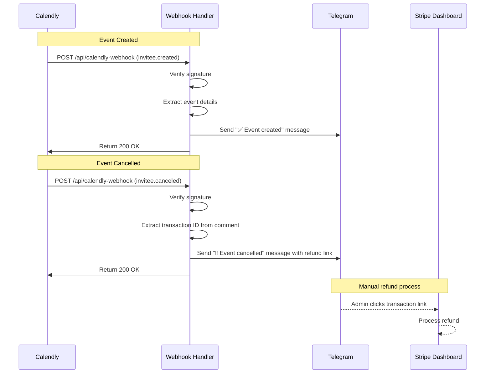

# Calendly Webhook Setup Documentation

## Overview

The Calendly webhook handler processes booking events and sends notifications to Telegram. It handles two main event types:
- `invitee.created` - When a new booking is made
- `invitee.canceled` - When a booking is cancelled

## Setup Instructions

### 1. Environment Configuration

Add the following to your `.env` file:

```env
CALENDLY_WEBHOOK_SECRET_KEY=your_webhook_signing_secret_here
```

### 2. Calendly Webhook Configuration

You need to add a webhook by calling [Calendly Webhook API](https://developer.calendly.com/api-docs/c1ddc06ce1f1b-create-webhook-subscription)

### 3. Local Testing via ngrok

#### Prerequisites
- Local server running (`pnpm dev`)
- Telegram credentials configured
- ngrok or similar tool for exposing local webhook endpoint (optional)

1. Install ngrok: `npm install -g ngrok` or download from https://ngrok.com
2. Start your local server: `pnpm dev`
3. Expose your local server:
   ```bash
   ngrok http 4321
   ```
4. Use the ngrok URL in Calendly webhook settings:
   ```
   https://your-ngrok-subdomain.ngrok.io/api/calendly-webhook
   ```

## Security

### Webhook Signature Verification

The webhook handler verifies the authenticity of incoming requests using HMAC SHA256 signature verification:

1. Calendly sends a signature in the `Calendly-Webhook-Signature` header
2. The signature format is: `t=timestamp,v1=signature`
3. The handler verifies the signature using the shared secret
4. Invalid signatures result in a 401 Unauthorized response

### Best Practices

- **Never expose the webhook secret** in client-side code or public repositories
- **Always verify signatures** to prevent unauthorized webhook calls
- **Use HTTPS** in production to ensure encrypted communication
- **Log webhook events** for debugging and audit purposes
- **Handle errors gracefully** - return 200 OK even on processing errors to prevent Calendly from retrying

## Troubleshooting

### Common Issues

1. **Signature verification fails**
   - Ensure the `CALENDLY_WEBHOOK_SECRET_KEY` matches the signing key from Calendly
   - Check that the webhook URL in Calendly matches your actual endpoint

2. **No Telegram messages received**
   - Verify `TELEGRAM_SECRET_KEY` and `TELEGRAM_CHAT_ID` are configured
   - Check server logs for Telegram API errors
   - Ensure the bot has permission to send messages to the chat

3. **Transaction ID not found in cancellation**
   - Verify the comment format in the booking includes the transaction ID
   - Check that the comment is saved in the first question position


## Integration Flow



## File Structure

```
src/
├── pages/
│   └── api/
│       └── calendly-webhook.ts    # Main webhook handler
├── services/
│   └── telegram.ts                # Telegram messaging service
└── components/
    └── booking/
        └── eventMessage.tsx        # Transaction ID utilities
```

## Event examples

- `/src/pages/api/stripe-webhook.ts` - Similar webhook pattern for Stripe
- `/src/services/calendly.ts` - Calendly API integration
- `/src/components/booking/eventMessage.tsx` - Comment formatting utilities

### `invitee.created`
```
{
  created_at: '2025-12-17T01:59:35.000000Z',
  created_by: 'https://api.calendly.com/users/4364d22a-e262-4000-87b9-55f8916525be',
  event: 'invitee.created',
  payload: {
    cancel_url: 'https://calendly.com/cancellations/38153610-b859-4b5f-b9bc-1f8eab4922fa',
    created_at: '2025-12-17T01:59:35.326465Z',
    email: 'ask@lopin.me',
    event: 'https://api.calendly.com/scheduled_events/d822f247-8f64-448e-831a-c160d9d98462',
    first_name: null,
    invitee_scheduled_by: 'https://api.calendly.com/users/4364d22a-e262-4000-87b9-55f8916525be',
    last_name: null,
    name: 'nik lopin',
    new_invitee: null,
    no_show: null,
    old_invitee: null,
    payment: null,
    questions_and_answers: [ [Object] ],
    reconfirmation: null,
    reschedule_url: 'https://calendly.com/reschedulings/38153610-b859-4b5f-b9bc-1f8eab4922fa',
    rescheduled: false,
    routing_form_submission: null,
    scheduled_event: {
      created_at: '2025-12-17T01:59:35.317039Z',
      end_time: '2026-01-19T12:30:00.000000Z',
      event_guests: [],
      event_memberships: [Array],
      event_type: 'https://api.calendly.com/event_types/42b4e39b-a004-4d6f-9c76-f15cd494e2c6',
      invitees_counter: [Object],
      location: [Object],
      meeting_notes_html: null,
      meeting_notes_plain: null,
      name: 'Cita Creativa',
      start_time: '2026-01-19T11:00:00.000000Z',
      status: 'active',
      updated_at: '2025-12-17T01:59:35.317039Z',
      uri: 'https://api.calendly.com/scheduled_events/d822f247-8f64-448e-831a-c160d9d98462'
    },
    scheduling_method: null,
    status: 'active',
    text_reminder_number: '+34655360607',
    timezone: 'Europe/Madrid',
    tracking: {
      utm_campaign: null,
      utm_source: null,
      utm_medium: null,
      utm_content: null,
      utm_term: null,
      salesforce_uuid: null
    },
    updated_at: '2025-12-17T01:59:35.326465Z',
    uri: 'https://api.calendly.com/scheduled_events/d822f247-8f64-448e-831a-c160d9d98462/invitees/38153610-b859-4b5f-b9bc-1f8eab4922fa'
  }
}
```

### `invitee.cancelled`

```
{
  created_at: '2025-12-17T02:01:12.000000Z',
  created_by: 'https://api.calendly.com/users/4364d22a-e262-4000-87b9-55f8916525be',
  event: 'invitee.canceled',
  payload: {
    cancel_url: 'https://calendly.com/cancellations/38153610-b859-4b5f-b9bc-1f8eab4922fa',
    cancellation: {
      canceled_by: 'SplashPlay Studio Barcelona',
      canceler_type: 'host',
      created_at: '2025-12-17T02:01:11.992334Z',
      reason: 'test'
    },
    created_at: '2025-12-17T01:59:35.326465Z',
    email: 'ask@lopin.me',
    event: 'https://api.calendly.com/scheduled_events/d822f247-8f64-448e-831a-c160d9d98462',
    first_name: null,
    invitee_scheduled_by: 'https://api.calendly.com/users/4364d22a-e262-4000-87b9-55f8916525be',
    last_name: null,
    name: 'nik lopin',
    new_invitee: null,
    no_show: null,
    old_invitee: null,
    payment: null,
    questions_and_answers: [ [Object] ],
    reconfirmation: null,
    reschedule_url: 'https://calendly.com/reschedulings/38153610-b859-4b5f-b9bc-1f8eab4922fa',
    rescheduled: false,
    routing_form_submission: null,
    scheduled_event: {
      cancellation: [Object],
      created_at: '2025-12-17T01:59:35.317039Z',
      end_time: '2026-01-19T12:30:00.000000Z',
      event_guests: [],
      event_memberships: [Array],
      event_type: 'https://api.calendly.com/event_types/42b4e39b-a004-4d6f-9c76-f15cd494e2c6',
      invitees_counter: [Object],
      location: [Object],
      meeting_notes_html: null,
      meeting_notes_plain: null,
      name: 'Cita Creativa',
      start_time: '2026-01-19T11:00:00.000000Z',
      status: 'canceled',
      updated_at: '2025-12-17T02:01:11.998165Z',
      uri: 'https://api.calendly.com/scheduled_events/d822f247-8f64-448e-831a-c160d9d98462'
    },
    scheduling_method: null,
    status: 'canceled',
    text_reminder_number: '+34655360607',
    timezone: 'Europe/Madrid',
    tracking: {
      utm_campaign: null,
      utm_source: null,
      utm_medium: null,
      utm_content: null,
      utm_term: null,
      salesforce_uuid: null
    },
    updated_at: '2025-12-17T02:01:12.007824Z',
    uri: 'https://api.calendly.com/scheduled_events/d822f247-8f64-448e-831a-c160d9d98462/invitees/38153610-b859-4b5f-b9bc-1f8eab4922fa'
  }
}
```
