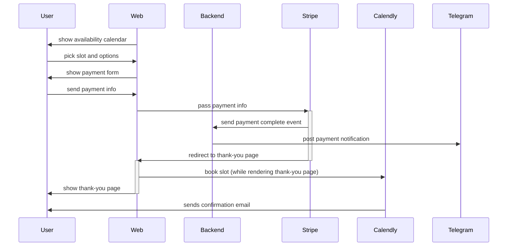

```mermaid
sequenceDiagram
    participant User
    participant Web
    participant Backend
    participant Stripe
    participant Calendly
    participant Telegram
    Web->>User: show availability calendar
    User->>Web: pick slot and options
    Web->>User: show payment form
    User->>Web: send payment info
    Web->>+Stripe: pass payment info
    Stripe->>Backend: send payment complete event
    Backend->>Telegram: post payment notification
    Stripe->>-Web: redirect to thank-you page
    activate Web
    Web->>Calendly: book slot (while rendering thank-you page)
    Web->>User: show thank-you page
    deactivate Web
    Calendly->>User: sends confirmation email
```
